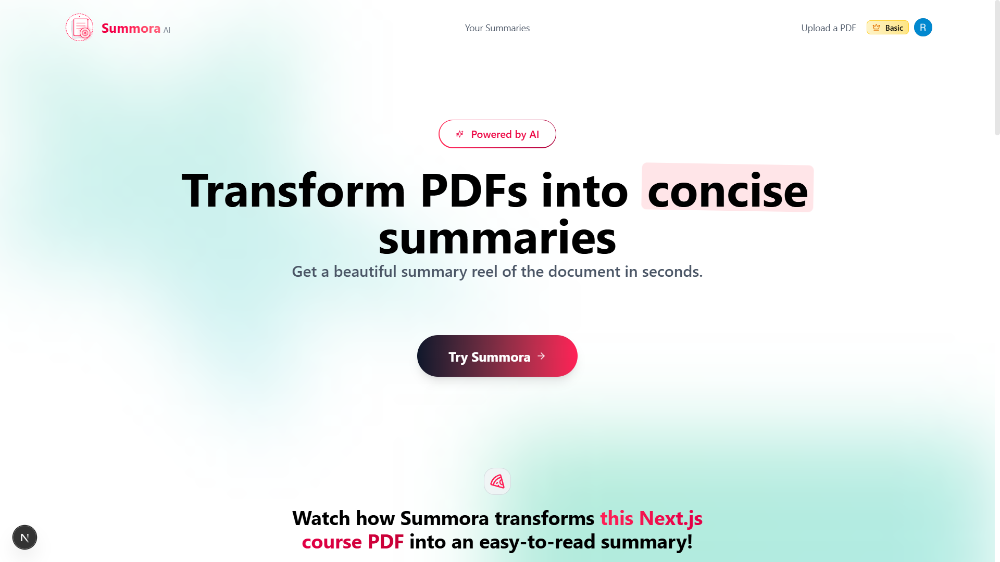

# 📄 Summora - AI-Powered PDF Summarization Platform



<!-- Add more screenshots or diagrams below -->

<!-- Example: -->
<!--  -->
<!--  -->

**Summora** is a modern web application that transforms lengthy PDF documents into concise, actionable summaries using advanced AI technology. Built with Next.js and TypeScript, it delivers a seamless user experience with intuitive uploads and efficient summary generation.

---

## ✨ Features

- 🤖 **AI-Powered Summarization:** Generate intelligent summaries using OpenAI GPT-4 and Google Gemini AI.
- 📁 **PDF Upload & Processing:** Secure file upload with support for various PDF formats.
- 👤 **User Authentication:** Complete user management with Clerk authentication.
- 💳 **Subscription Management:** Integrated Stripe payments with Pro and Basic plans.
- 📊 **Dashboard:** Personal dashboard to manage and view all your summaries.
- 🎨 **Modern UI:** Beautiful, responsive design with Tailwind CSS and Framer Motion.
- 🔒 **Secure:** Type-safe codebase with comprehensive error handling.
- ⚡ **Fast:** Optimized performance with Next.js and Turbopack.

---

## 🚀 Getting Started

### Prerequisites

- Node.js 18+
- PostgreSQL database
- Clerk account (authentication)
- OpenAI API key
- Google AI API key
- Stripe account (payments)
- UploadThing account (file storage)

### Installation

1. **Clone the repository**

   ```bash
   git clone <repository-url>
   cd Summora
   ```

2. **Install dependencies**

   ```bash
   npm install
   ```

3. **Set up environment variables**

   Create a `.env.local` file in the root directory:

   ```env
   # Database
   DATABASE_URL="your_postgresql_connection_string"

   # Clerk Authentication
   NEXT_PUBLIC_CLERK_PUBLISHABLE_KEY="your_clerk_publishable_key"
   CLERK_SECRET_KEY="your_clerk_secret_key"
   NEXT_PUBLIC_CLERK_SIGN_IN_URL="/sign-in"
   NEXT_PUBLIC_CLERK_SIGN_UP_URL="/sign-up"

   # AI APIs
   OPENAI_API_KEY="your_openai_api_key"
   GOOGLE_AI_API_KEY="your_google_ai_api_key"

   # Stripe
   STRIPE_SECRET_KEY="your_stripe_secret_key"
   NEXT_PUBLIC_STRIPE_PUBLISHABLE_KEY="your_stripe_publishable_key"
   STRIPE_WEBHOOK_SECRET="your_stripe_webhook_secret"

   # UploadThing
   UPLOADTHING_SECRET="your_uploadthing_secret"
   UPLOADTHING_APP_ID="your_uploadthing_app_id"
   ```

4. **Set up the database**

   ```bash
   npm run setup-db
   ```

5. **Build the application**

   ```bash
   npm run build
   ```

6. **Start the development server**
   ```bash
   npm run dev
   ```
   The application will be available at [http://localhost:3000](http://localhost:3000).

---

## 🏗️ Project Structure

<!-- ```
Summora/
├── actions/                 # Server actions for data mutations
│   ├── summary-actions.ts   # Summary CRUD operations
│   └── upload-action.ts     # File upload handling
├── app/                     # Next.js app directory
│   ├── (logged-in)/         # Protected routes
│   ├── api/                 # API routes
│   └── layout.tsx           # Root layout
├── components/              # React components
│   ├── common/              # Shared components
│   ├── summaries/           # Summary-related components
│   ├── upload/              # Upload components
│   └── ui/                  # UI primitives
├── lib/                     # Utility libraries
│   ├── db.ts                # Database connection
│   ├── openai.ts            # OpenAI integration
│   ├── geminiai.ts          # Google AI integration
│   └── stripe.ts            # Stripe integration
├── utils/                   # Helper utilities
└── database/                # Database schema
``` -->

# 📁 Summora Directory Structure

```
Summora/
├── 📁 actions/                 # Server actions for data mutations
│   ├── summary-actions.ts     # Summary CRUD operations
│   └── upload-action.ts       # File upload handling
├── 📁 app/                    # Next.js App Router
│   ├── 📁 (logged-in)/        # Protected routes for authenticated users
│   │   ├── dashboard/         # User dashboard
│   │   ├── summaries/         # Summary management
│   │   └── upload/            # File upload interface
│   ├── 📁 api/                # API routes
│   │   ├── auto-sync/         # Auto-sync functionality
│   │   ├── payment/           # Payment processing
│   │   └── webhooks/          # External service webhooks
│   ├── contact/               # Contact page
│   ├── pricing/               # Pricing plans
│   └── layout.tsx            # Root layout
├── 📁 components/             # React components
│   ├── 📁 common/             # Shared UI components
│   │   ├── bg-gradient.tsx    # Background gradients
│   │   ├── plan-badge.tsx     # User plan indicator
│   │   └── motion-wrapper.tsx # Animation wrapper
│   ├── 📁 summaries/          # Summary-related components
│   ├── 📁 upload/             # Upload UI components
│   ├── 📁 contact/            # Contact form components
│   └── 📁 ui/                 # Reusable UI primitives
├── 📁 lib/                    # Utility libraries
│   ├── db.ts                  # DB connection & queries
│   ├── openai.ts              # OpenAI API logic
│   ├── geminiai.ts            # Google Gemini API logic
│   ├── stripe.ts              # Stripe integration
│   ├── summaries.ts           # Summary generation logic
│   └── user.ts                # User-related utilities
├── 📁 utils/                  # Miscellaneous helpers
│   ├── constants.ts           # Global constants
│   ├── prompts.ts             # AI prompt templates
│   └── file-format.ts         # File parsing utilities
├── 📁 database/               # Database schema
│   └── schema.sql             # PostgreSQL schema definition
├── 📁 scripts/                # Setup/utility scripts
│   ├── setup-database.ts      # DB initialization script
│   └── create-stripe-price.ts # Create Stripe products/pricing
└── 📁 public/                 # Static assets
    ├── 📁 screenshots/        # Screenshots for documentation
    ├── summora.png            # App logo
    └── sitemap.xml            # SEO sitemap
```

---

## 🛠️ Available Scripts

- `npm run dev` — Start development server with Turbopack
- `npm run build` — Build for production
- `npm start` — Start production server
- `npm run lint` — Run ESLint
- `npm run setup-db` — Initialize database
- `npm run test:upload` — Test upload functionality
- `npm run test:summary` — Test summary generation

---

## 🔧 Technology Stack

**Frontend**

- Next.js 14 (App Router)
- TypeScript
- Tailwind CSS
- Framer Motion
- Radix UI

**Backend**

- Next.js API Routes
- PostgreSQL
- Clerk (Authentication)
- Stripe (Payments)
- UploadThing (File uploads)

**AI & Processing**

- OpenAI GPT-4
- Google Gemini AI
- LangChain (PDF text extraction)
- PDF.js

---

## 📱 Usage

1. **Sign Up/Login:** Create an account or sign in using Clerk authentication.
2. **Upload PDF:** Navigate to the upload page and select your PDF file.
3. **Generate Summary:** The AI will process and summarize your document.
4. **View Summaries:** Access all your summaries from the dashboard.
5. **Manage Subscription:** Upgrade to Pro for unlimited summaries.

---

## 🔒 Authentication & Authorization

Summora uses Clerk for comprehensive user management:

- Email/password authentication
- Social login options
- User profile management
- Session handling
- Protected routes

---

## 💳 Subscription Plans

- **Basic (Free):** Limited uploads per month
- **Pro:** Unlimited uploads and summaries

---

## 🚀 Deployment

Optimized for deployment on Vercel:

1. Connect your repository to Vercel
2. Configure environment variables
3. Deploy with automatic builds

---

## 🧪 Testing

Run the test suite:

```bash
npm run test:upload    # Test upload functionality
npm run test:summary   # Test summary generation
npm run test:db        # Test database operations
```

---

## 🤝 Contributing

1. Fork the repository
2. Create a feature branch (`git checkout -b feature/amazing-feature`)
3. Commit your changes (`git commit -m 'Add amazing feature'`)
4. Push to the branch (`git push origin feature/amazing-feature`)
5. Open a Pull Request

---

## 📝 License

This project is licensed under the MIT License — see the LICENSE file for details.

---

## 🆘 Support

If you encounter any issues or have questions:

- Check the Issues page
- Contact support through the application
- Review the documentation

---

## 🙏 Acknowledgments

- OpenAI for GPT-4 API
- Google for Gemini AI
- Clerk for authentication services
- Stripe for payment processing
- Vercel for hosting platform

Built with ❤️ by [Your Name]

---

## 📚 Case Study: Summora Web App

**Overview:**
Summora is my web application focused on creating a seamless user experience with features like intuitive uploads and efficient summary generation. Here's a breakdown of some of the technical challenges I faced during development and how I addressed them.

---

## 1. Migrating to TypeScript & Codebase Cleanup

**Challenge:**
My project originally had a mix of JavaScript and TypeScript files, with some redundant code and commented-out sections. This made it hard to maintain and debug, especially as the codebase grew.

**Solution:**

- I fully migrated the code to TypeScript to ensure type safety across the application.
- Enabled strict type-checking to catch errors early and improve code reliability.
- Cleaned up unnecessary `.js` files and comments, making the code more maintainable.

---

## 2. Fixing Upload Form & ForwardRef Issues

**Challenge:**
The upload form was malfunctioning because I initially mishandled input components and misused React’s `forwardRef`, leading to bugs in the UI and errors during form submission.

**Solution:**

- I refactored the form and its input components to use `forwardRef` correctly.
- Added stronger TypeScript types to ensure better consistency and predictability.
- Improved the error-handling mechanisms, resulting in a more reliable and user-friendly upload experience.

---

## 3. Debugging Production-Only Upload Failures

**Challenge:**
The upload and summary features worked fine on my local environment, but when deployed to production, they failed silently with no visible error messages. This was frustrating to debug.

**Solution:**

- I added detailed logging to capture errors in production.
- After analyzing the logs, I discovered a `401` error from UploadThing due to missing domain whitelisting and an environment misconfiguration.
- Once I corrected the configuration, the upload feature started working as expected in production.

---

## 4. Surfacing Silent Failures in Summary Generation

**Challenge:**
The summary generation feature was failing in production with no feedback to the user, which made it difficult to pinpoint the issue.

**Solution:**

- I enhanced the error-handling and logging mechanisms to display backend errors in the browser console.
- This allowed me to quickly diagnose and resolve the issue, ensuring that summary generation is now reliable.

---

## 5. Resolving Module Resolution & Stale Build Artifacts

**Challenge:**
In production, I encountered a persistent error (`TypeError: ...generatePdfText... is not a function`) even though the code was correct.

**Solution:**

- I discovered that stale `.js` files were shadowing the TypeScript modules.
- After clearing the build caches and redeploying, the issue was resolved, and the production environment stabilized.

---

## 6. Improving Type Safety & Error Handling

**Challenge:**
Some server actions and utilities didn’t have explicit types or proper error handling, which made them prone to runtime failures.

**Solution:**

- I added explicit TypeScript types to all server actions and utilities to make the code more predictable.
- Enhanced error handling to catch edge cases and ensure smoother user experiences.

---

This case study highlights some of the key challenges I faced during the development of Summora Web App and the solutions I implemented to improve its stability, maintainability, and user experience.
